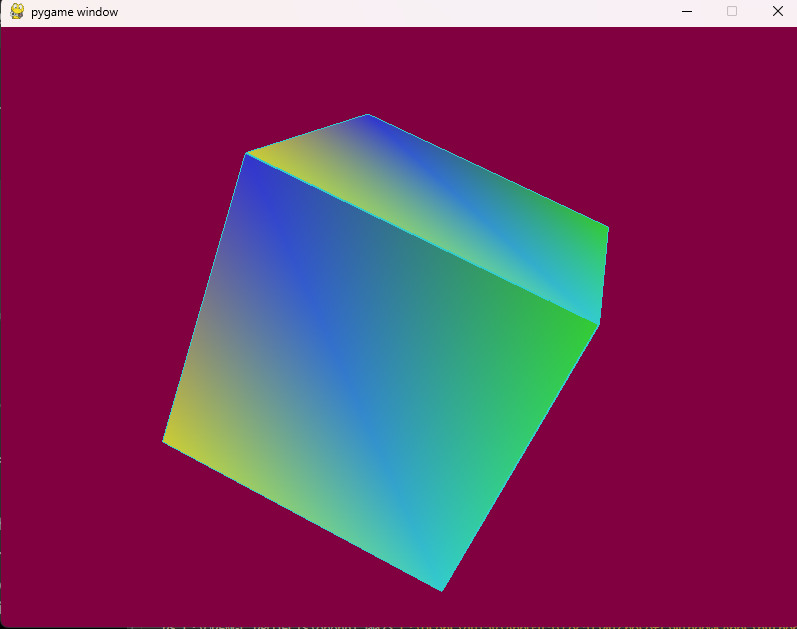

# Rendering with COLORS in PyOpenGL


We first create our colors that we will use as a shaders for surfaces
```py
colors = (
    (0.8, 0.2, 0.2), # Red
    (0.2, 0.8, 0.2), # Green
    (0.2, 0.2, 0.8), # Blue
    (0.8, 0.8, 0.2), # Yellow
    (0.2, 0.8, 0.8), # Cyan
    (0.8, 0.2, 0.8)  # Magenta
)
```

Next we traverse to each #quads and we will call it as #quad. We then create a way to get all of the colors per index in this one we will call it as #x

```glColor3fv``` we will use this function and set the color per index

```py
for quad in quads:
    x = 0
    for vertex in quad:
        x += 1
        glColor3fv(colors[x])
        glVertex3fv(vertices[vertex]) //get the surfaces and color each
```

